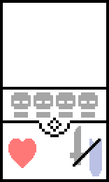

MENTAL CARD
==============

# story
asd

# card
 

## info

### type
풀 < 불 < 물
### attack
공격력
### deffence
방어력
### health point
카드의 HP가 0 이하가 될 경우 배치되어 있던 그 카드는 소멸 된다.

# rule

### 1. 턴
----------------

턴이 돌아가며 자신의 턴에 '드로우', '카드 배치', '전투'를 할 수 있다.

### 2. 드로우
----------------

자신의 턴 시작에 덱 맨 위의 카드를 손(패)으로 가져온다.

### 3. 카드 배치
----------------

###  일반 배치   
자신 턴에 손(패)에서 재물이 필요없는 카드를 필드에 배치 할 수 있다.

###  재물 배치   
자신 턴에 손(패)에서 재물이 필요한 카드를 대상으로 필요한 재물 수 이상

### 4. 공격
----------------

### 카드 공격
자신 필드의 모든 카드는 각각의 앞에 카드가 배치 되어 있을 경우 그 카드를 공격한다. 공격한 카드의 HP가 0 이하가 될 경우 필드에서 없어진다.

### 직접 공격
자신 필드의 모든 카드는 각각의 앞에 카드가 배치 되어 있지 않을 경우 상대방을 직접 공격한다.

### 5. 대미지 계산
----------------

### 카드 공격시 계산
다음은 공격시 타입에 따른 방어력 무시 관계이다.   
( 풀 < 불 < 물 < 풀 < ... ) < ???

#### 방어력 무시 (O)
HP(상대 카드) - ATK(자신 카드) = y
#### 방어력 무시 (X)
HP(상대 카드) - ( DEF(상대 카드) - ATK(자신 카드) ) = y  
(단, 방어력을 공격력이 넘지 못 할 경우 아무런 계산도 하지 않는다.)

### 직접 공격시 계산
카드의 공격력 그대로 상대방의 HP를 차감한다.

### 6. 승리 조건
----------------

상대가 HP를 모두 소모하였을 때 필드의 카드의 유무에 상관없이 승리한다.
